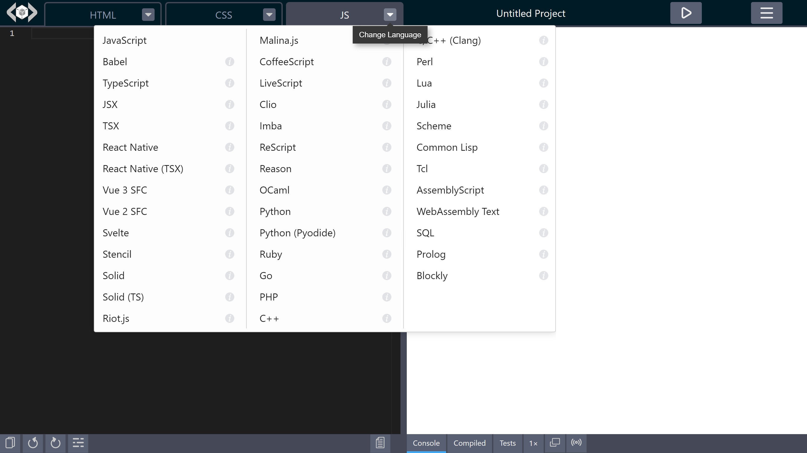

# Configuration Object

## TypeScript Types

TypeScript types are [documented here](../api/interfaces/Config.md) and can be imported from the library.

```ts
import type { Config } from 'livecodes';
```

## Default Config

Default config is [defined here](https://github.com/live-codes/livecodes/blob/develop/src/livecodes/config/default-config.ts).

## Project Content

These are properties that define the content of the current [project](../features/projects.md).

### `title`

[`string`](../api/interfaces/ContentConfig#title)

Default: `"Untitled Project"`

Project title. This is used as [result page](../features/result.md) title.

### `description`

[`string`](../api/interfaces/ContentConfig#description)

Default: `""`

Project description. Used in [project](../features/projects.md) search. This can be set in the UI from app menu → Project Info.

### `tags`

[`string[]`](../api/interfaces/ContentConfig#tags)

Default: `[]`

Project tags. Used in [project](../features/projects.md) filter and search. This can be set in the UI from app menu → Project Info.

### `activeEditor`

[`"markup" | "style" | "script" | undefined`](../api/interfaces/ContentConfig#activeeditor)

Default: Last used editor for user, otherwise "markup"

Selects the active editor to show.

### `languages`

[`Language[] | undefined`](../api/interfaces/ContentConfig#languages)

Default: all supported languages in full app and only current editor languages in [embeds](../features/embeds.md).

List of enabled languages. Languages that are not already loaded in the editors ([markup](#markup), [style](#style) and [script](#script)) can be selected from a drop down menu at the editor title.



### `markup`

[`Editor`](../api/interfaces/Editor)

Default: `{ language: 'html', content: '' }`

Configures the language and content of the markup editor.

### `style`

[`Editor`](../api/interfaces/Editor)

Default: `{ language: 'css', content: '' }`

Configures the language and content of the style editor.

### `script`

[`Editor`](../api/interfaces/Editor)

Default: `{ language: 'javascript', content: '' }`

Configures the language and content of the script editor.

### `stylesheets`

[`string[]`](../api/interfaces/ContentConfig#stylesheets)

Default: `[]`

List of URLs for [external stylesheets](../features/external-css-js.md) to add to the [result page](../features/result.md).

### `scripts`

[`string[]`](../api/interfaces/ContentConfig#scripts)

Default: `[]`

List of URLs for [external scripts](../features/external-css-js.md) to add to the [result page](../features/result.md).

### `cssPreset`

[`"" | "normalize.css" | "reset-css"`](../api/interfaces/ContentConfig.md#csspreset)

Default: `""`

[CSS Preset](../features/css-presets.md) to use.

### `processors`

[`Processor[]`](../api/modules#processor)

Default: `[]`

List of enabled [CSS processors](../features/css-processors.md).

### `customSettings`

[`CustomSettings`](../api/interfaces/ContentConfig.md#customsettings)

Default: `{}`

Defines [custom settings](../advanced/custom-settings.md) for the current project.

### `imports`

[`[key: string]: string`](../api/interfaces/ContentConfig.md#imports)

Default: `{}`

Allows specifying custom [import maps](https://github.com/WICG/import-maps) for [module imports](../features/npm-modules.md).

For example, adding this JavaScript code:

```js
import moment from 'moment';
import { partition } from 'lodash';
```

would add this import map in the result page:

```html
<script type="importmap">
  {
    "imports": {
      "moment": "https://cdn.skypack.dev/moment",
      "lodash": "https://cdn.skypack.dev/lodash"
    }
  }
</script>
```

However, if `imports` is specified as follows:

```json
{
  "imports": {
    "moment": "https://cdn.jsdelivr.net/npm/moment@2.29.4/dist/moment.js"
  }
}
```

The import map becomes like this:

```html
<script type="importmap">
  {
    "imports": {
      "moment": "https://cdn.jsdelivr.net/npm/moment@2.29.4/dist/moment.js",
      "lodash": "https://cdn.skypack.dev/lodash"
    }
  }
</script>
```

:::info Note

Currently, multiple import maps are not yet supported. https://crbug.com/927119

When bare module imports are encountered, LiveCodes adds an import map to the result page. If you need to add custom import map or override the automatically generated one, you need to add them to `imports` config property or `imports` [customSettings](#customsettings) property.

:::

### `types`

### `tests`

### `version`

## App Settings

### `readonly`

### `allowLangChange`

### `mode`

### `showVersion`

### `tools`

## User Settings

### `autoupdate`

### `autosave`

### `delay`

### `formatOnsave`

### `theme`

### `recoverUnsaved`

### `showSpacing`

### `editor`

### `fontFamily`

### `fontSize`

### `useTabs`

### `tabSize`

### `lineNumbers`

### `wordWrap`

### `closeBrackets`

### `emmet`

### `editorMode`

### `semicolons`

### `singleQuote`

### `trailingComma`
