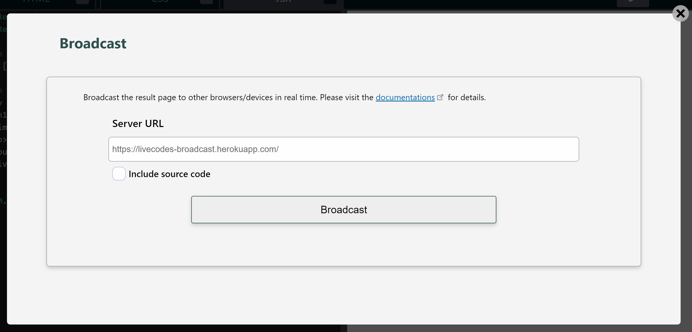
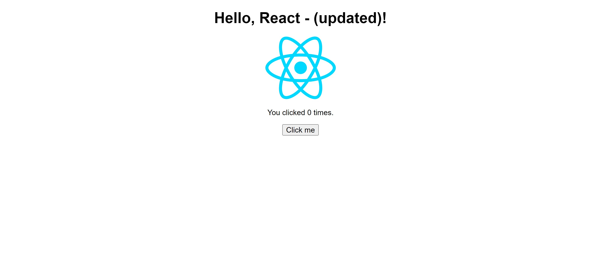
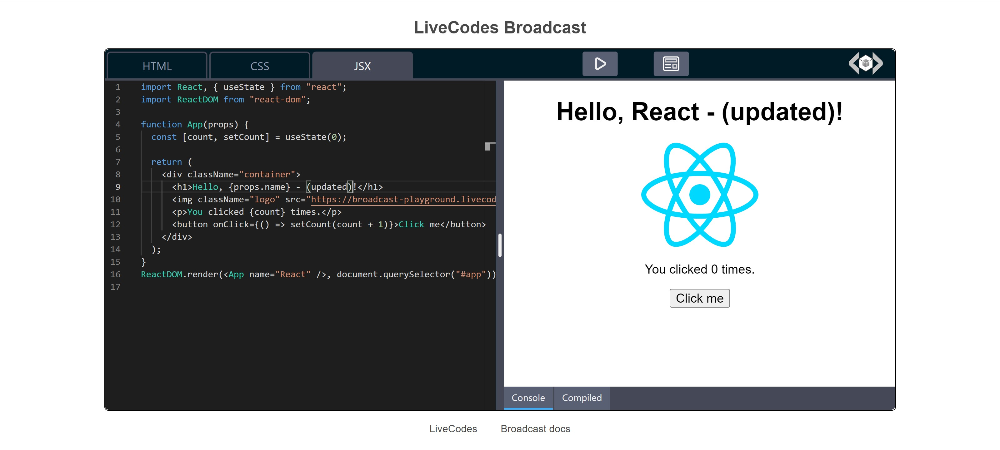

# Broadcast

## Overview

LiveCodes Broadcast allows sending the [result page](./result.md) (and optionally source & compiled code and project configuration) to custom API. This can be used to live-view result page updates on different browsers/devices in real-time or broadcast live-coding sessions.

:::note

Broadcast can only be performed from the full app, and not from embedded playgrounds.

:::

The `Broadcast` screen can be accessed from the settings menu → Broadcast, or from the Broadcast icon in the [tools pane](./tools-pane.md) (below the result page).



On connecting to the server, the channel URL returned by the server is displayed. The channel URL can be shared to different clients (browsers on same or different devices) to view result page or code updates in real-time.

If the option `Include source code` is enabled, the source and compiled code together with the current project configuration are also posted to the server with each update.


The Broadcast icon (in tools pane), shows the broadcast status. Clicking the icon, opens the broadcast UI, where the channel URL is displayed and the broadcast can be stopped.


:::info Server

An open-source example implementation of an API server is available on: [live-codes/broadcast](https://github.com/live-codes/broadcast).

It is a [simple implementation](https://github.com/live-codes/broadcast/blob/main/index.js), which you can use or extend. It makes use of LiveCodes [Embeds](./embeds.md) and [API](../advanced/api.md) for code broadcasting.

A demo, free-to-test, instance is hosted on:
https://livecodes-broadcast.onrender.com/ (low resources - sleeps after 15 minutes of inactivity)

You can use one of these links to self-host it:

<a href="https://render.com/deploy?repo=https://github.com/live-codes/broadcast">
  
</a>
&nbsp;&nbsp;&nbsp;
<a href="https://heroku.com/deploy?template=https://github.com/live-codes/broadcast/tree/main">
  
</a>

:::

:::tip Hosted API

[LiveCodes sponsors](../sponsor.md) get access to a hosted (always-on) API, which they can use without having to manage their own server.

:::

These are screenshots for the live-updated result page and code:





## Technical Details

When starting a broadcast, the app sends a `POST` request to the specified server with a body that has the following properties:

- `result`: a string with the result page html.
- `data` (Only if `Include source code` option is enabled): an object containing source and compiled code together with the current project configuration.
- `userToken` (Optional): Can be used by the server to authorize users who can broadcast (see below how to set it).

When the server successfully creates a channel, it should respond by sending a JSON object with the following properties:

- `channel`: a string representing the channel Id.
- `channelUrl`: a string with the URL of the channel that can be shared to the clients who want to connect to it.
- `channelToken`: a string representing a secret token for this channel, to prevent others from sending to the same channel. This is only sent once (in response to the request that created the channel).

The `channel` and `channelToken` are remembered by the app, and are sent in subsequent requests for the same channel (with every result page update). They are deleted when stopping broadcast or when the app reloads.

:::note

To set a `userToken` for authorization with a broadcast server, run the following in the browser console:

```js
await livecodes.exec('setBroadcastToken', 'my-token');
```

The supplied value (in this case `my-token`) will be posted to the server with every update as the value for the property `userToken`.

This value is saved for the current user across app reloads.
