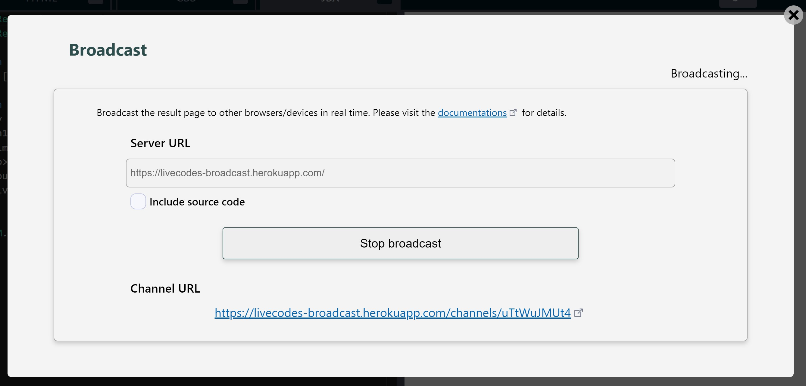

# Broadcast

LiveCodes Broadcast allows sending the [result page](./result.md) (and optionally source & compiled code) to custom API. This can be used to live-view result page updates on different browsers/devices in real-time.

:::note

Broadcast is only available in the full app, and not in embedded playgrounds.

:::

The Broadcast UI can be accessed from the settings menu → Broadcast, or from the Broadcast icon in the [tools pane](./tools-pane.md) (below the result page).

On connecting to the server, the channel URL returned by the server is displayed. The channel URL can be shared to different clients (browsers on same or different devices) to view result page updates in real-time.

If the option `Include source code` is enabled, the source and compiled code is also posted to the server with each update.

The Broadcast icon (in tools pane), shows the broadcast status. Clicking the icon, opens the broadcast UI, where the channel URL is displayed and the broadcast can be stopped.

:::info Example

An open-source example implementation of an API server is available on: [live-codes/broadcast](https://github.com/live-codes/broadcast).

It is a simple implementation (with a [single-file backend](https://github.com/live-codes/broadcast/blob/main/index.js) and a [single-file frontend](https://github.com/live-codes/broadcast/blob/main/index.html)), which you can use or extend.

A demo, free-to-test, instance is hosted on:
https://livecodes-broadcast.herokuapp.com/ (sleeps after 30 mins of inactivity)

:::

:::tip Hosted API

[LiveCodes sponsors](../sponsor.md) get access to a hosted (always-on) API, which they can use without having to manage their own server.

:::
